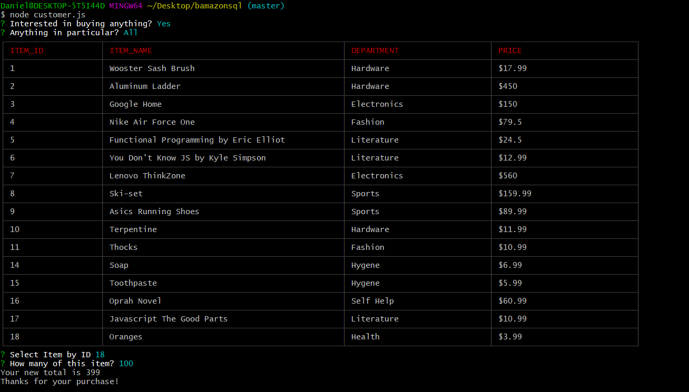
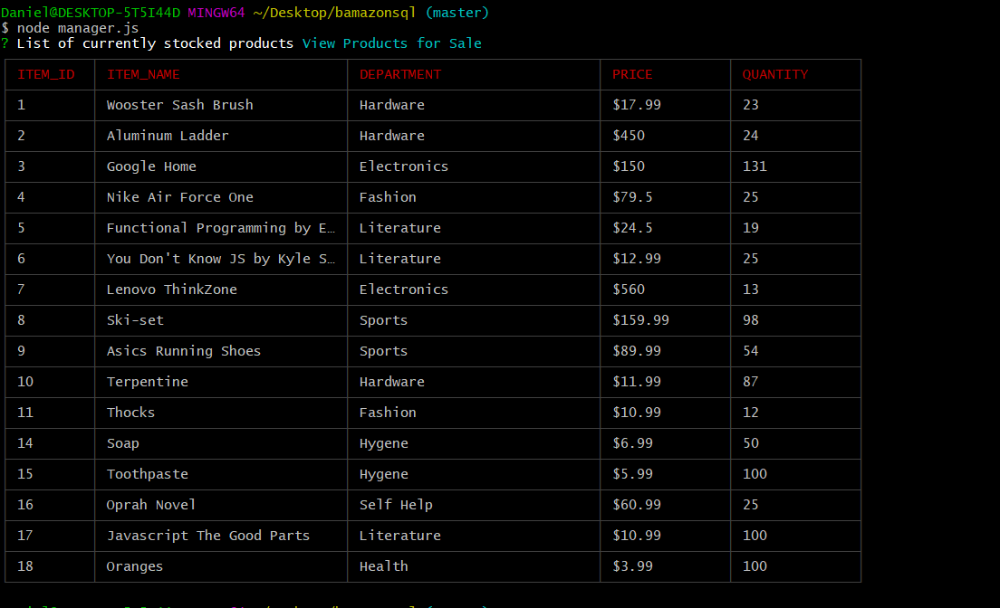
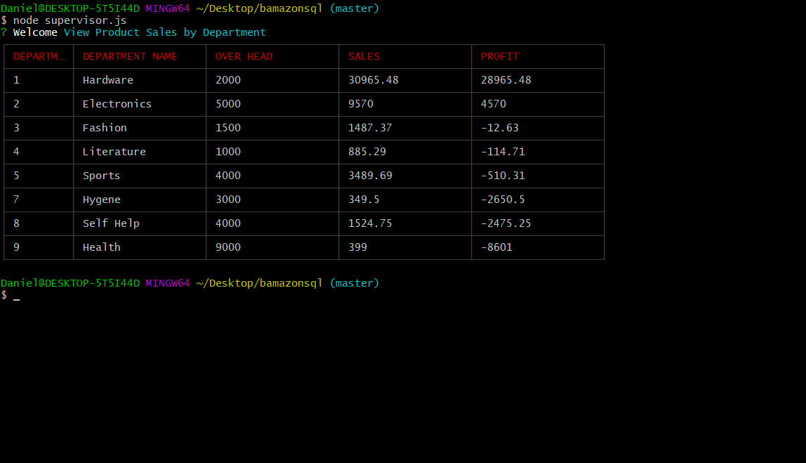

# bamazonsql

##Dependencies:
- npm inquirer

- npm mysql

- cli-table

-NodeJS

-MySQL

<h1>Basic Store-Front Interface</h1>

- Used from the command line

- Pulls information from an sql database

- For Customers: Buy products using the command line, your total is shown at the end of the transaction, the quantity you bought is reflected in the database.

- For Managers: Can look at the current inventory (this table includes prices), view products that are currently low in stock, update the inventory, and add new products.

- For Supervisors(WORKING): Current a supervisor can see the total product sales per department. Also, the supervisor portion of this app can create new departments which the manager portion can add items to, customer can buy from. 

<h1>DEMOs</h1>
-Supervisor
https://drive.google.com/file/d/11fhMsN8So-fXGVuDgXZB-k0FQuwgDv5R/view
-Manager
https://drive.google.com/file/d/1Q61xi394DVCMRZaaXiikghEtBI63pIqZ/view
-Customer
https://drive.google.com/file/d/1G1V3bM2JpJ8q6hMb4oNb3u_XG7CoqxTP/view

<h1>Screenshots</h1>

<ul>
  <h3>Customer</h3>
<li></li>
   <h3>Manager</h3>
<li></li>
   <h3>Supervisor</h3>
<li></li>
</ul>

